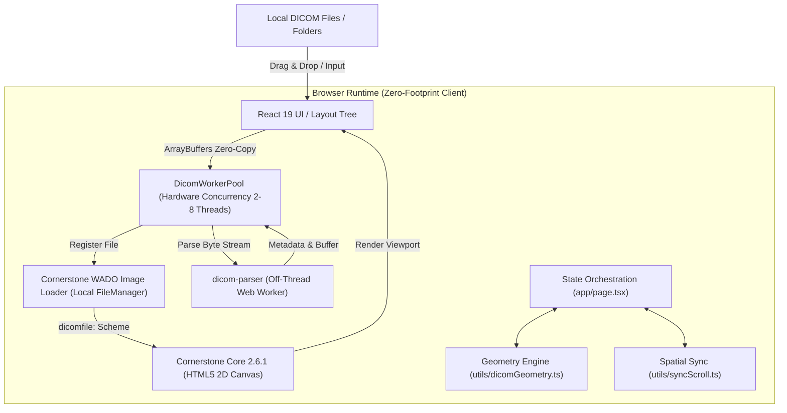
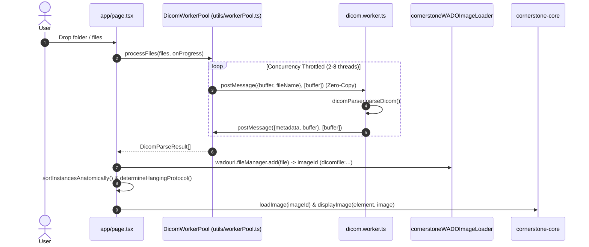
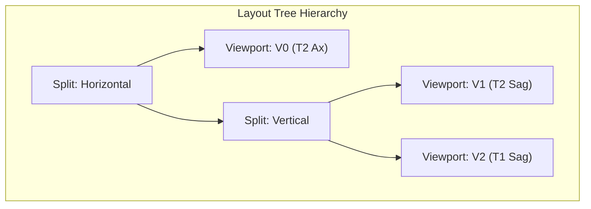

# ARCHITECTURE.md — div.DICOM System Architecture

## 1. Executive Architectural Overview

div.DICOM is a zero-footprint, client-side medical image viewing application engineered with **Next.js 15 (App Router)**, **TypeScript**, **Cornerstone.js (v2.6.1)**, and **Tailwind CSS v4**.

All binary ingestion, parsing, decompression, pixel rendering, anatomical geometry calculations, measurements, and clinical reporting execute entirely within the local browser runtime. Sensitive Patient Health Information (PHI) and DICOM binaries never leave the user's workstation.

---

## 2. Source-Verified Architecture Analysis (20 Architectural Areas)

Every area below is classified by verification level:
- **[VERIFIED FROM SOURCE]**: Traced and proven in the codebase.
- **[INFERRED]**: Derived logically from verified patterns.
- **[UNKNOWN]**: Not evident in current code or commit history.
- **[UNVERIFIED]**: Hypothesized but unconfirmed.

---

### 1. Application Entry Points [VERIFIED FROM SOURCE]
- **Root Layout (`app/layout.tsx`)**: Minimal HTML structure configuring dark mode theme (`bg-black text-neutral-100`), system font families (`Geist`, `Geist Mono`), metadata, and viewport meta tags.
- **Primary Page (`app/page.tsx`)**: Client component marked `'use client'`. Serves as the central state coordinator, orchestrating Cornerstone lifecycle, Web Worker parsing, active tool selection, multi-viewport layout tree rendering, and modal dialogs.

### 2. UI & Component Architecture [VERIFIED FROM SOURCE]
The UI is modularized into specialized component hierarchies:
- **Toolbar (`components/toolbar/`)**: `ViewerToolbar.tsx` coordinates `ToolButtonGroup.tsx`, `LayoutPresetPicker.tsx`, and `MeasurementTrashMenu.tsx`.
- **Sidebar (`components/sidebar/`)**: `Sidebar.tsx` hosts `StudyList.tsx`, `SeriesCard.tsx`, `SeriesThumbnail.tsx`, and `ReportingPanel.tsx`.
- **Viewport Grid (`components/viewport/`)**: `LayoutRenderer.tsx` recursively renders layout nodes; `ViewportOverlay.tsx` displays patient HUD overlays; `OrientationMarkers.tsx` renders anatomical directions; `ViewportActionBar.tsx` provides split/maximize controls; `ViewportInfoButton.tsx` activates tag inspection.
- **Dialogs & Modals (`components/dialogs/`)**: `DisclaimerModal.tsx`, `HelpModal.tsx`, `PatientMismatchDialog.tsx`, `RemoveAllDialog.tsx`, `RawMetadataModal.tsx`, `GlobalDropOverlay.tsx`.
- **Icons (`components/Icons.tsx`)**: Custom SVGs for medical imaging tools.

### 3. State Management Architecture [VERIFIED FROM SOURCE]
- **React Local State**: Centralized in `app/page.tsx` for studies (`studies`), viewports (`viewports`), layout tree (`layoutTree`), active tool (`activeTool`), measurements (`measurements`), parsing indicators, and dialog visibility.
- **Synchronous Ref Caching**:
  - `renderRequestSeqRef`: Per-viewport monotonic request sequence counter (`renderRequestSeqRef.current[index]++`). Discards stale async image decoding frames during rapid mouse-wheel scrolling.
  - `lastRenderedKeyRef`: Tracks `${studyUID}_${seriesUID}_${imageIndex}` per viewport to avoid redundant re-renders.
  - `cursor3DRef`: Stores ephemeral 3D patient coordinates, source viewport index, canvas position, and sampled pixel value for live crosshair rendering.
  - `panningViewportIndexRef`: Identifies active panning viewport to render the signature #3584F5 center crosshair.
  - `viewportRefs`: Holds DOM element references to Cornerstone canvas mounts.

### 4. DICOM Loading Pipeline [VERIFIED FROM SOURCE]
- **Entry Methods**: Drag-and-drop onto viewport/sidebar/overlay, or folder selection with `webkitdirectory`.
- **File System Filtering (`utils/dicomFiles.ts`)**: Filters out OS metadata files (`Zone.Identifier`, `._*`, `.DS_Store`, `Thumbs.db`, `desktop.ini`) and buffers under 132 bytes.
- **Directory Traversal (`traverseFileTree`)**: Asynchronously traverses directory trees via `FileSystemDirectoryReader.readEntries()`.
- **Ingestion & Matching**: Grouped into `DICOMStudy[]` and `DICOMSeries[]`. Mismatched patient IDs trigger `PatientMismatchDialog` with options to Append or Replace.

### 5. DICOM Parsing Subsystem [VERIFIED FROM SOURCE]
- **Execution**: Runs inside Web Worker (`app/workers/dicom.worker.ts`) using `dicom-parser`.
- **Validation**: Verifies pixel data elements (`x7fe00010`, `x7fe00008`, `x7fe00009`).
- **Metadata Extraction**: Extracts patient demographics, study identifiers, acquisition parameters, and 3D spatial geometry tags.
- **Raw Tag Dictionary**: Iterates all dataset elements and maps hex tags to standard names via `dicom-data-dictionary`.

### 6. Web Worker Architecture [VERIFIED FROM SOURCE]
- **Worker Pool Manager (`utils/workerPool.ts` -> `DicomWorkerPool`)**:
  - Pool size is dynamically bounded: `Math.max(2, Math.min(navigator.hardwareConcurrency - 1, 8))`.
  - Task queue with worker reuse and idle/busy tracking.
  - Zero-copy buffer transfers using JavaScript Transferable Objects (`[buffer]`).
  - Progress reporting through `(processed, total)` callbacks.

### 7. Cornerstone Initialization & Lifecycle [VERIFIED FROM SOURCE]
- **Centralized Initializer (`utils/cornerstoneInit.ts`)**:
  - Dynamically imports `cornerstone-core`, `cornerstone-wado-image-loader`, and `dicom-parser`.
  - Connects externals: `cornerstoneWADOImageLoader.external.cornerstone = cornerstone` and `external.dicomParser = parser`.
  - Registers loaders for `dicomfile` and `wadouri` schemes.
  - Viewport DOM elements are enabled via `cornerstone.enable(element)` and resized on layout adjustments via `cornerstone.resize(element)`.

### 8. Rendering Pipeline [VERIFIED FROM SOURCE]
- **Image Rendering (`renderViewportImage`)**:
  - Checks request sequence counter to prevent out-of-order race conditions.
  - Calls `cornerstone.loadImage(instance.imageId)` and `cornerstone.displayImage(element, image)`.
  - Preserves viewport transforms (`translation`, `scale`, `voi`, `rotation`, `flip`) across slice changes when `keepTransforms=true`.
  - Dispatches `drawMeasurements(element, index)` to refresh measurement overlays.
- **Overlay Canvas (`canvas.measurement-canvas`)**:
  - Transparent overlay canvas placed on top of each Cornerstone canvas (`pointer-events-none z-10`).
  - Renders scout/reference lines, length lines, angle arcs, ROI polygons, pan crosshairs, and 3D cursor crosshairs.

### 9. Viewport Architecture & Hanging Protocols [VERIFIED FROM SOURCE]
- **Layout Tree (`utils/types.ts` -> `LayoutNode`)**:
  - Tree structure supporting recursive horizontal/vertical splits and single viewport nodes.
  - Manipulated via `splitViewportNode` and `closeViewportNode` (`utils/layoutHelpers.ts`).
- **Hanging Protocol Engine (`determineHangingProtocol`)**:
  - 1 series: 1x1 single viewport.
  - 2 series: 1x2 two columns.
  - 3 series (generic): 1x3 three columns.
  - 3 series (Spine MRI: T2 Ax, T2 Sag, T1 Sag): 1+2 layout (T2 Ax left; T2/T1 Sag stacked right).
  - 4+ series: 2x2 grid.

### 10. DICOM Coordinate Systems [VERIFIED FROM SOURCE]
Three primary coordinate spaces are maintained:
1. **Canvas Space**: CSS pixel coordinates $(x, y)$ relative to viewport DOM canvas.
2. **Image Pixel Space**: Column index $u$ ($0 \le u < 	ext{columns}$) and Row index $v$ ($0 \le v < 	ext{rows}$).
3. **Patient Reference Coordinate System (RCS - DICOM PS 3.3)**:
   - 3D millimeter space $(X, Y, Z)$ defined by patient anatomy:
     - $+X$: Left (L), $-X$: Right (R)
     - $+Y$: Posterior (P), $-Y$: Anterior (A)
     - $+Z$: Head/Superior (H), $-Z$: Feet/Inferior (F)
   - Origin: $S = 	ext{ImagePositionPatient} = [S_x, S_y, S_z]$.
   - Direction Cosines: $	ext{ImageOrientationPatient} = [X_x, X_y, X_z, Y_x, Y_y, Y_z]$.
   - Slice Normal: $N = 	ext{normalize}(X 	imes Y)$.
   - Pixel Spacing: $[\Delta y, \Delta x] = [ps_{row}, ps_{col}]$ (`pixelSpacing[0]` is row spacing, `pixelSpacing[1]` is column spacing).

### 11. Image Geometry Calculations [VERIFIED FROM SOURCE]
- **Image Pixel to Patient RCS**:
  $$P_{world} = S + X \cdot (u \cdot ps_{col}) + Y \cdot (v \cdot ps_{row})$$
- **Patient RCS to Image Pixel**:
  $$ec{d} = P_{world} - S$$
  $$u = rac{ec{d} \cdot X}{ps_{col}}, \quad v = rac{ec{d} \cdot Y}{ps_{row}}, \quad d_{normal} = |ec{d} \cdot N|$$
- **Orientation Markers (`getOrientationMarkers`)**:
  - Projects row and column vectors onto dominant axes to generate Left/Right and Top/Bottom anatomical labels.
- **Slice Location HUD (`getFormattedSliceLocation`)**:
  - Computes 3D slice center: $C = S + X \cdot rac{(	ext{cols}-1) \cdot ps_{col}}{2} + Y \cdot rac{(	ext{rows}-1) \cdot ps_{row}}{2}$.
  - Projects onto dominant normal axis (e.g. "Loc: R 15.5 mm", "Loc: H 42.0 mm").

### 12. Anatomical Slice Ordering [VERIFIED FROM SOURCE]
- **Spatial Sorting (`sortInstancesAnatomically`)**:
  - Evaluates normal vector $N$ from reference slice's `ImageOrientationPatient`.
  - Projects each instance's `ImagePositionPatient` onto $N$: $d = 	ext{dot}(	ext{IPP}, N)$.
  - Sorts instances in ascending geometric order along slice normal.
  - Fallbacks: Sorts by `sliceLocation` if IPP/IOP missing; secondary fallback to `instanceNumber`.

### 13. Cross-Reference & Viewport Synchronization [VERIFIED FROM SOURCE]
- **Plane Intersection Lines (`calculateIntersection`)**:
  - Computes intersection line between slice plane normals $N_A 	imes N_B$.
  - Clips line against 3D bounding box corners of Plane A.
  - Transforms intersection endpoints into Plane B's 2D pixel space.
- **Linked Slice Scrolling (`findClosestParallelSliceIndex`)**:
  - Validates parallel slice planes ($|N_A \cdot N_B| > 0.99$).
  - Projects source slice origin onto target series normal to find closest slice index.
- **3D Spatial Cursor & Pixel Probe (`updatePixelProbe`)**:
  - Converts active mouse position to $P_{world}$.
  - Auto-scrolls other orthogonal viewports to matching slice plane (`findClosestSliceTo3DPoint`).
  - Samples raster pixel data and applies Rescale Slope/Intercept for Hounsfield Unit (HU) display.

### 14. Measurement Subsystems [VERIFIED FROM SOURCE]
- **Length**: $L = \sqrt{(\Delta x \cdot ps_{col})^2 + (\Delta y \cdot ps_{row})^2}$ mm.
- **Angle**: Intersecting vector dot product: $	heta = rccos\left(rac{v_1 \cdot v_2}{|v_1||v_2|}
ight) \cdot rac{180^\circ}{\pi}$.
- **ROI Polygon**:
  - Area computed via Shoelace formula in $	ext{mm}^2$ ($	ext{Area}_{px} \cdot ps_{col} \cdot ps_{row}$).
  - Samples raster data using ray-casting point-in-polygon algorithm.
  - Applies $HU = 	ext{PixelValue} \cdot m + b$ to calculate Mean, Standard Deviation, Min, Max.

### 15. Metadata Handling & Tag Inspector [VERIFIED FROM SOURCE]
- Structured schema in `utils/types.ts` (`DICOMInstance`, `DICOMSeries`, `DICOMStudy`, `ImagePlaneMetadata`).
- Full DICOM header inspector modal (`RawMetadataModal.tsx`) with search, formatted `(GGGG,EEEE)` tags, and dictionary names.

### 16. Memory & Resource Lifecycle [VERIFIED FROM SOURCE]
- **Series Deletion (`handleRemoveSeries`)**:
  - Explicitly removes image load objects: `cornerstone.imageCache.removeImageLoadObject(id)`.
  - Explicitly removes files from loader: `loader.wadouri.fileManager.remove(id)`.
  - Clears associated measurements.
- **Complete Purge (`handleRemoveAll`)**:
  - Calls `cornerstone.imageCache.purgeCache()` and `loader.wadouri.fileManager.purge()`.
  - Resets viewport elements, studies, and state.
- **Blob URLs**: Revoked after download triggering.

### 17. Network Communication Audit [VERIFIED FROM SOURCE]
- **DICOM Data**: 100% local in-browser execution. Zero external requests for image data or metadata.
- **Version Check**: Single client-side `fetch('https://api.github.com/repos/jaaniin/div.DICOM/releases/latest')` on mount to notify user of available updates.

### 18. Privacy & Zero-Footprint Behavior [VERIFIED FROM SOURCE]
- Strict zero-footprint architecture preserved. No analytics, tracking pixels, or remote data serialization.

### 19. Testing Architecture [VERIFIED FROM SOURCE]
- **Test Framework**: Vitest 4.1.11 (`vitest.config.mts`).
- **Test Suites (4 files, 40 tests passing)**:
  - `tests/dicomGeometry.test.ts`: Vector math, cross/dot products, normal vectors, orientation markers, intersection math, slice location strings, anatomical sorting.
  - `tests/layoutHelpers.test.ts`: Layout tree splitting, node closing, visible index collection, hanging protocols.
  - `tests/syncScroll.test.ts`: 3D coordinate conversion, projection, parallel slice matching.
  - `tests/reportGenerator.test.ts`: Report formatting, filename generation, patient name anonymization.

### 20. Build & Deployment Architecture [VERIFIED FROM SOURCE]
- Next.js 15.4.9 (runtime 15.5.23) App Router with standalone output (`output: 'standalone'`).
- Strict TypeScript (`typescript: 5.9.3`, `strict: true`).
- Tailwind CSS 4.1.11 with `@tailwindcss/postcss`.
- Production build verified passing with 0 errors.

---

## 3. Technical Debt & Architectural Risks

| Rank | Severity | Area | Issue | Impact | Status / Mitigation |
| :--- | :--- | :--- | :--- | :--- | :--- |
| **1** | **MEDIUM** | React Hooks | Missing hook dependencies in `app/page.tsx` (`useEffect`) | Potential stale closure warnings in dev mode | Address via `useCallback` stabilization in Phase 2 |
| **2** | **MEDIUM** | Package Inventory | Unused dependencies in `package.json` (`cornerstone-tools`, `@hookform/resolvers`, `ts-morph`) | Unnecessary package weight | Audit and clean in Phase 2 |
| **3** | **LOW** | 3D Capability | Legacy Cornerstone v2 is 2D Canvas-based; true 3D MPR requires synthetic pixel resampling or future Cornerstone3D evaluation | MPR must be computed in memory | Planned for MPR milestone |

